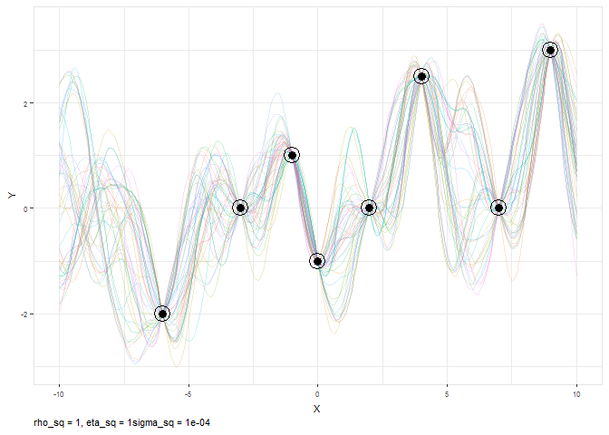

gp sim
================
TJ Mahr
December 29, 2016

Adapting from here: <https://gist.github.com/mrecos/2e04349935534f317a86a260095dafe0>

``` r
library(rstan)
```

    ## Warning: package 'rstan' was built under R version 3.3.2

    ## Loading required package: ggplot2

    ## Warning: package 'ggplot2' was built under R version 3.3.2

    ## Loading required package: StanHeaders

    ## Warning: package 'StanHeaders' was built under R version 3.3.2

    ## rstan (Version 2.14.1, packaged: 2016-12-28 14:55:41 UTC, GitRev: 5fa1e80eb817)

    ## For execution on a local, multicore CPU with excess RAM we recommend calling
    ## rstan_options(auto_write = TRUE)
    ## options(mc.cores = parallel::detectCores())

``` r
eta_sq = 1
rho_sq = 1
sigma_sq = 0.0001
x <- seq(-10, 10, 0.1)
n <- length(x)
iter = 100
chains = 1
rho_sq_range = c(0.01, 0.1, 1, 10) # for faceted kernel plot
eta_sq_prior = c(0.1, 1, 10)
rho_sq_prior = c(0.1, 1, 10)

# new data for fit
x1 <- c(-6, -3, -1, 0, 2, 4, 7, 9)
y1 <- c(-2, 0, 1, -1, 0, 2.5, 0, 3)
```

``` r
## Simulate with a few noise-free data points to get posterior.
## still fixed values for eta and rho
## Again pretend the noise is almost zero, but not quite.
stan_data <- list(
  x1 = x1, y1 = y1, N1 = length(x1), x2 = x, N2 = length(x), 
  eta_sq = eta_sq, rho_sq = rho_sq, sigma_sq = sigma_sq
)

fit2 <- stan(
  file = "gp-predict-se.stan", 
  data = stan_data, 
  iter = iter, 
  chains = chains)
```

    ## In file included from C:/Users/trist/Documents/R/win-library/3.2/BH/include/boost/config.hpp:39:0,
    ##                  from C:/Users/trist/Documents/R/win-library/3.2/BH/include/boost/math/tools/config.hpp:13,
    ##                  from C:/Users/trist/Documents/R/win-library/3.2/StanHeaders/include/stan/math/rev/core/var.hpp:7,
    ##                  from C:/Users/trist/Documents/R/win-library/3.2/StanHeaders/include/stan/math/rev/core/gevv_vvv_vari.hpp:5,
    ##                  from C:/Users/trist/Documents/R/win-library/3.2/StanHeaders/include/stan/math/rev/core.hpp:12,
    ##                  from C:/Users/trist/Documents/R/win-library/3.2/StanHeaders/include/stan/math/rev/mat.hpp:4,
    ##                  from C:/Users/trist/Documents/R/win-library/3.2/StanHeaders/include/stan/math.hpp:4,
    ##                  from C:/Users/trist/Documents/R/win-library/3.2/StanHeaders/include/src/stan/model/model_header.hpp:4,
    ##                  from file15cc3ab1896.cpp:8:
    ## C:/Users/trist/Documents/R/win-library/3.2/BH/include/boost/config/compiler/gcc.hpp:186:0: warning: "BOOST_NO_CXX11_RVALUE_REFERENCES" redefined
    ##  #  define BOOST_NO_CXX11_RVALUE_REFERENCES
    ##  ^
    ## <command-line>:0:0: note: this is the location of the previous definition
    ## In file included from C:/Users/trist/Documents/R/win-library/3.2/BH/include/boost/multi_array/base.hpp:28:0,
    ##                  from C:/Users/trist/Documents/R/win-library/3.2/BH/include/boost/multi_array.hpp:21,
    ##                  from C:/Users/trist/Documents/R/win-library/3.2/BH/include/boost/numeric/odeint/util/multi_array_adaption.hpp:29,
    ##                  from C:/Users/trist/Documents/R/win-library/3.2/BH/include/boost/numeric/odeint.hpp:61,
    ##                  from C:/Users/trist/Documents/R/win-library/3.2/StanHeaders/include/stan/math/prim/arr/functor/integrate_ode_rk45.hpp:13,
    ##                  from C:/Users/trist/Documents/R/win-library/3.2/StanHeaders/include/stan/math/prim/arr.hpp:36,
    ##                  from C:/Users/trist/Documents/R/win-library/3.2/StanHeaders/include/stan/math/prim/mat.hpp:299,
    ##                  from C:/Users/trist/Documents/R/win-library/3.2/StanHeaders/include/stan/math/rev/mat.hpp:11,
    ##                  from C:/Users/trist/Documents/R/win-library/3.2/StanHeaders/include/stan/math.hpp:4,
    ##                  from C:/Users/trist/Documents/R/win-library/3.2/StanHeaders/include/src/stan/model/model_header.hpp:4,
    ##                  from file15cc3ab1896.cpp:8:
    ## C:/Users/trist/Documents/R/win-library/3.2/BH/include/boost/multi_array/concept_checks.hpp: In static member function 'static void boost::multi_array_concepts::detail::idgen_helper<N>::call(Array&, const IdxGen&, Call_Type)':
    ## C:/Users/trist/Documents/R/win-library/3.2/BH/include/boost/multi_array/concept_checks.hpp:42:43: warning: typedef 'index_range' locally defined but not used [-Wunused-local-typedefs]
    ##        typedef typename Array::index_range index_range;
    ##                                            ^
    ## C:/Users/trist/Documents/R/win-library/3.2/BH/include/boost/multi_array/concept_checks.hpp:43:37: warning: typedef 'index' locally defined but not used [-Wunused-local-typedefs]
    ##        typedef typename Array::index index;
    ##                                      ^
    ## C:/Users/trist/Documents/R/win-library/3.2/BH/include/boost/multi_array/concept_checks.hpp: In static member function 'static void boost::multi_array_concepts::detail::idgen_helper<0ull>::call(Array&, const IdxGen&, Call_Type)':
    ## C:/Users/trist/Documents/R/win-library/3.2/BH/include/boost/multi_array/concept_checks.hpp:53:43: warning: typedef 'index_range' locally defined but not used [-Wunused-local-typedefs]
    ##        typedef typename Array::index_range index_range;
    ##                                            ^
    ## C:/Users/trist/Documents/R/win-library/3.2/BH/include/boost/multi_array/concept_checks.hpp:54:37: warning: typedef 'index' locally defined but not used [-Wunused-local-typedefs]
    ##        typedef typename Array::index index;
    ##                                      ^
    ## In file included from C:/Users/trist/Documents/R/win-library/3.2/StanHeaders/include/stan/math/rev/core.hpp:42:0,
    ##                  from C:/Users/trist/Documents/R/win-library/3.2/StanHeaders/include/stan/math/rev/mat.hpp:4,
    ##                  from C:/Users/trist/Documents/R/win-library/3.2/StanHeaders/include/stan/math.hpp:4,
    ##                  from C:/Users/trist/Documents/R/win-library/3.2/StanHeaders/include/src/stan/model/model_header.hpp:4,
    ##                  from file15cc3ab1896.cpp:8:
    ## C:/Users/trist/Documents/R/win-library/3.2/StanHeaders/include/stan/math/rev/core/set_zero_all_adjoints.hpp: At global scope:
    ## C:/Users/trist/Documents/R/win-library/3.2/StanHeaders/include/stan/math/rev/core/set_zero_all_adjoints.hpp:14:17: warning: 'void stan::math::set_zero_all_adjoints()' defined but not used [-Wunused-function]
    ##      static void set_zero_all_adjoints() {
    ##                  ^
    ## 
    ## SAMPLING FOR MODEL 'gp-predict-se' NOW (CHAIN 1).
    ## WARNING: The initial buffer, adaptation window, and terminal buffer
    ##          overflow the total number of warmup iterations.
    ##          Defaulting to a 15%/75%/10% partition,
    ##            init_buffer = 7
    ##            adapt_window = 38
    ##            term_buffer = 5
    ## 
    ## 
    ## Chain 1, Iteration:  1 / 100 [  1%]  (Warmup)
    ## Chain 1, Iteration: 10 / 100 [ 10%]  (Warmup)
    ## Chain 1, Iteration: 20 / 100 [ 20%]  (Warmup)
    ## Chain 1, Iteration: 30 / 100 [ 30%]  (Warmup)
    ## Chain 1, Iteration: 40 / 100 [ 40%]  (Warmup)
    ## Chain 1, Iteration: 50 / 100 [ 50%]  (Warmup)
    ## Chain 1, Iteration: 51 / 100 [ 51%]  (Sampling)
    ## Chain 1, Iteration: 60 / 100 [ 60%]  (Sampling)
    ## Chain 1, Iteration: 70 / 100 [ 70%]  (Sampling)
    ## Chain 1, Iteration: 80 / 100 [ 80%]  (Sampling)
    ## Chain 1, Iteration: 90 / 100 [ 90%]  (Sampling)
    ## Chain 1, Iteration: 100 / 100 [100%]  (Sampling)
    ##  Elapsed Time: 31.455 seconds (Warm-up)
    ##                23.296 seconds (Sampling)
    ##                54.751 seconds (Total)

``` r
sims2 <- extract(fit2, permuted = TRUE)

## Rearrange the data for plotting
se_sim_data2 <- plyr::adply(sims2$y, 2)
tmp2 <- reshape2::melt(se_sim_data2)
```

    ## Using X1 as id variables

``` r
names(tmp2) <- c("xid", "group", "y")
tmp2 <- plyr::mutate(tmp2, x = x[xid])
# plot it
fig2b <- ggplot(data = tmp2, aes(x=x, y=y)) +
  geom_line(aes(group=group, color = group), alpha=0.2) +
  theme_bw() +
  geom_point(data=data.frame(x=x1, y=y1), aes(x=x1, y = y1), size = 3) +
  geom_point(data=data.frame(x=x1, y=y1), aes(x=x1, y = y1),
             size = 6, color = "black", shape = 1) +
  labs(caption=paste0("rho_sq = ", rho_sq, ", eta_sq = ", eta_sq, "sigma_sq = ", sigma_sq),
       x = "X", 
       y = "Y") +
  # scale_x_continuous(limits = c(-10,10), breaks = seq(-10,10,by=1), labels = seq(-10,10,by=1)) +
  # scale_y_continuous(limits = c(-3,3), breaks = seq(-3,3,by=1), labels = seq(-3,3,by=1)) +
  theme(
    panel.border = element_rect(colour = "gray90"),
    axis.text.x = element_text(angle = 0, size = 6, family = "Trebuchet MS"),
    axis.text.y = element_text(size = 6, family = "Trebuchet MS"),
    axis.title = element_text(size = 8, family = "Trebuchet MS"),
    plot.caption = element_text(size = 8, hjust=0, 
                                family = "Trebuchet MS"),
    plot.title=element_text(family="TrebuchetMS-Bold"),
    plot.subtitle=element_text(family="TrebuchetMS-Italic"),
    legend.position="none"
  )
plot(fig2b)
```

    ## Warning in grid.Call(L_textBounds, as.graphicsAnnot(x$label), x$x, x$y, :
    ## font family not found in Windows font database

    ## Warning in grid.Call(L_textBounds, as.graphicsAnnot(x$label), x$x, x$y, :
    ## font family not found in Windows font database

    ## Warning in grid.Call(L_textBounds, as.graphicsAnnot(x$label), x$x, x$y, :
    ## font family not found in Windows font database

    ## Warning in grid.Call(L_textBounds, as.graphicsAnnot(x$label), x$x, x$y, :
    ## font family not found in Windows font database

    ## Warning in grid.Call(L_textBounds, as.graphicsAnnot(x$label), x$x, x$y, :
    ## font family not found in Windows font database

    ## Warning in grid.Call(L_textBounds, as.graphicsAnnot(x$label), x$x, x$y, :
    ## font family not found in Windows font database

    ## Warning in grid.Call(L_textBounds, as.graphicsAnnot(x$label), x$x, x$y, :
    ## font family not found in Windows font database

    ## Warning in grid.Call.graphics(L_text, as.graphicsAnnot(x$label), x$x, x
    ## $y, : font family not found in Windows font database

    ## Warning in grid.Call(L_textBounds, as.graphicsAnnot(x$label), x$x, x$y, :
    ## font family not found in Windows font database


